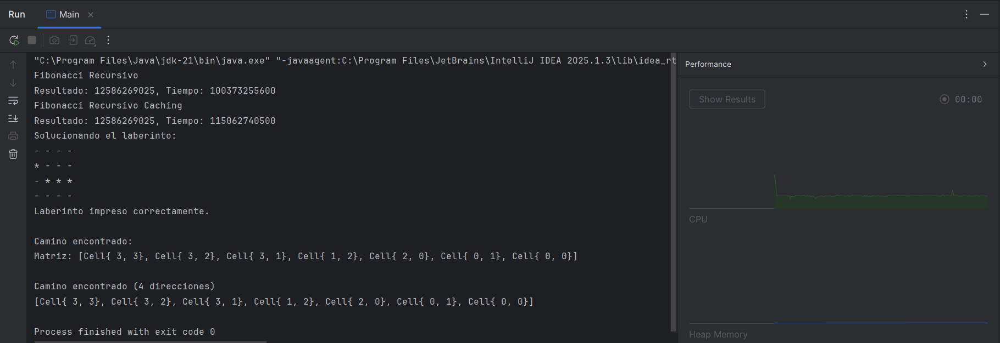

# Programacion Dinamica

## 📌 Información General

- **Título:** Programacion Dinamica
- **Asignatura:** Estructura de Datos
- **Carrera:** Computación
- **Estudiante:** Erick Yunga
- **Fecha:** 16/07/2025
- **Profesor:** Ing. Pablo Torres

---

## 🛠️ Descripción

Este proyecto presenta dos aplicaciones fundamentales de la recursión y la programación dinámica en Java:
## 1. Serie de Fibonacci
- Se implementan dos versiones del cálculo de Fibonacci:
- Recursiva clásica: sin optimización, útil para comprender la estructura básica.
- Programación dinámica (memoización): mejora el rendimiento almacenando resultados previos.
- Se comparan los tiempos de ejecución para evidenciar la eficiencia de la técnica de memoización.
## 2. Resolución de Laberintos
- Se representa un laberinto como una matriz de valores booleanos (true para caminos, false para paredes).
- Se implementa un algoritmo recursivo (MazeSolverRecursivo) que explora el laberinto en busca de un camino desde un punto de inicio hasta un destino.
- Se incluye una versión extendida (MazeSolverRecursivo2) que permite explorar en las cuatro direcciones cardinales.
- El camino encontrado se almacena y se imprime como una lista de coordenadas.
  Este proyecto refuerza conceptos clave como:
- Recursión
- Backtracking
- Memoización
- Modelado de estructuras de datos
- Diseño modular y reutilizable


---

## 🚀 Ejecución

Para ejecutar el proyecto:

1. Compila el código:
    ```bash
    javac Main.java
    ```
2. Ejecuta la aplicación:
    ```bash
    java Main
    ```

---

## 📤 Ejemplo de Salida Esperada



